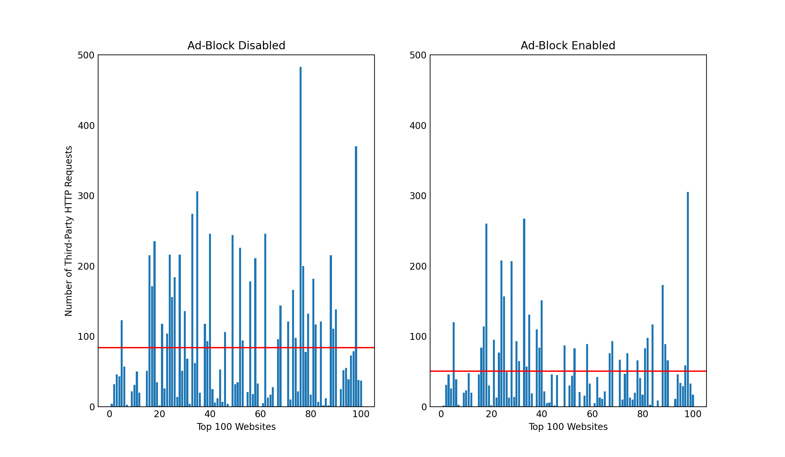
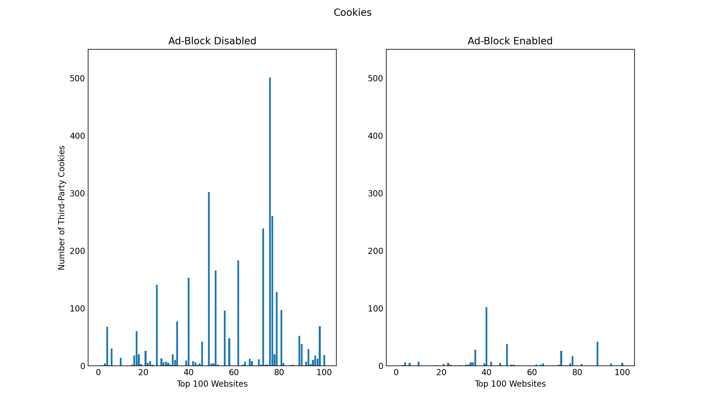
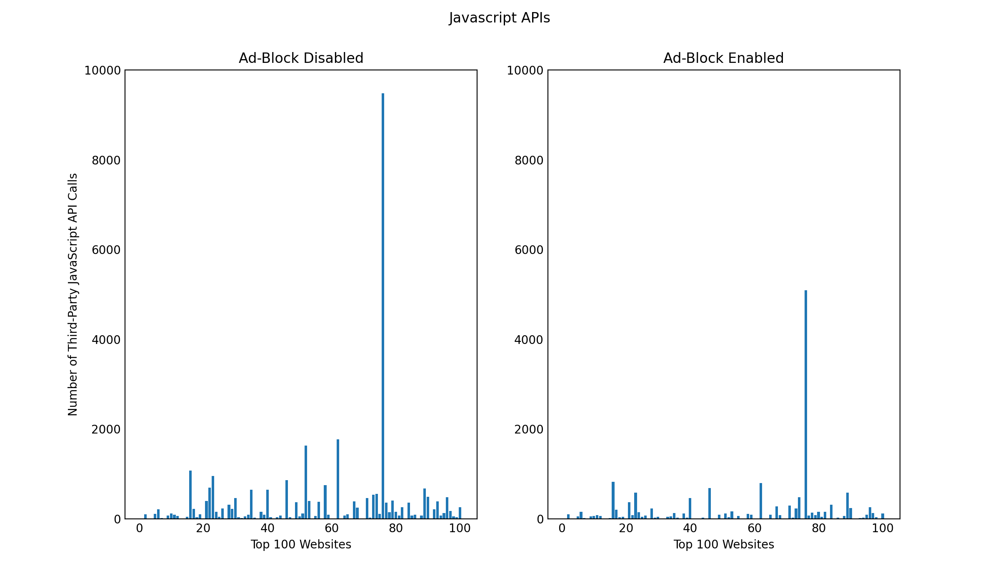

# OpenWPM Intro Project
## External Resources
The web crawls were conducted using the web privacy measurement framework OpenWPM. Further information about the framework can be found at the following repository: [https://github.com/mozilla/OpenWPM/blob/master/README.md](https://github.com/mozilla/OpenWPM/blob/master/README.md).

The top 100 websites were shortlisted and retrieved from [Tranco](https://tranco-list.eu/download_daily/56JN).
## Background
This project presents findings and analysis on data collected by crawling 100 websites using the OpenWPM framework. While conducting the crawls, three distinct metrics (HTTP Requests, Cookies, Javascript API Calls) were monitored in two different browser environments. The browsing environments were identical in all ways except the second browsing environment had an active ad-blocking extension (U Block Origin). The purpose of this project was to analyze the impacts this ad-blocking agent had on the three metrics that were being monitored.

## Third-Party HTTP Requets

By comparing the number of HTTP requests made in an "Ad-Block Enabled" versus "Ad-Block Disabled" browsing environment depicted in the plot above, it is apparent that having the Ad-Blocker active substantially reduces the number of third-party HTTP requests made. A numerical comparison of the mean number of third-party HTTP requests made in both browsing environments supports this claim as well, as without an Ad-Blocker active an average of 84.09 third-party HTTP requests were made compared to 50.56 with an Ad-Blocker active.

### Most Popular Third Party Domains
Without Ad-Block Enabled:
|         Domain        | # of HTTP Requests |
|:---------------------:|:------------------:|
| ssl-images-amazon.com |         471        |
| alicdn.com            |         264        |
| doubleclick.net       |         262        |
| msocdn.com            |         249        |
| google.com            |         228        |
| pstatic.net           |         215        |
| cloudfront.net        |         204        |
| pinimg.com            |         200        |
| awsstatic.com         |         156        |
| qhimg.com             |         149        |

With Ad-Block Enabled:
|         Domain        | # of HTTP Requests |
|:---------------------:|:------------------:|
| ssl-images-amazon.com |         531        |
| msocdn.com            |         249        |
| alicdn.com            |         202        |
| cloudfront.net        |         199        |
| pinimg.com            |         190        |
| pstatic.net           |         173        |
| qhimg.com             |         150        |
| awsstatic.com         |         138        |
| twimg.com             |         121        |
| sinaimg.cn            |         119        |

The most common third-party domains in both browsing environments seem to be CDNs `(msocdn.com, alicdn.com, cloudfront.net)`. The other domains in the lists are either ad-serving services `(double-click.net)` or image-hosting domains `(ssl-images-amazon.com, pinimg.com, twimg.com)`.

## Third-Party Cookies

By analyzing the plot above, it is evident that have an active ad-blocker greatly reduces the number of third-party cookies stored on a given device. This is supported by a numerical comparison as the mean number of cookies stored on the device without an active Ad-Blocker was 31.28 while the mean number of cookies stored with an active Ad-Blocker was approximately 1/10 of that value at 3.47. 

### Most Popular Third Party Domains
Without Ad-Block Enabled:
|       Domain       |    # of Cookies    |
|:------------------:|:------------------:|
| yahoo.com          |         310        |
| demdex.net         |         217        |
| pubmatic.com       |         203        |
| doubleclick.net    |         133        |
| rubiconproject.com |         131        |
| amazon.com         |         130        |
| adsrvr.org         |         117        |
| linkedin.com       |         92         |
| casalemedia.com    |         77         |
| rlcdn.com          |         72         |

With Ad-Block Enabled:
|     Domain    |    # of Cookies    |
|:-------------:|:------------------:|
| amazon.com    |         102        |
| microsoft.com |         24         |
| youtube.com   |         23         |
| aliexpress.ru |         20         |
| tmall.ru      |         19         |
| bbc.com       |         17         |
| live.com      |         16         |
| iscrv.com     |         14         |
| google.com    |         13         |
| sina.cn       |         11         |

When the ad-blocker wasn't active, most of the third-party cookies came from digital ad-serving domains. In fact, three of the top five third-party domains from the "Ad-Block Disabled" environment fall under this category `(pubmatic.com, doubleclick.net, rubiconproject.com)`. `demdex.net` serves a more specialized purpose, however, as it collects behavioral data and collects it in a data bank for websites and advertisers to use. Conversely, in the "Ad-Block Enabled" environment most third-party cookies came from large and well-known companies such as Amazon, Google, and Microsoft.  

## Third-Party JavaScript API Calls

Similar to the other two metrics monitored, the plot depicted above also demonstrates that having an Ad-Blocker active greatly reduces the number of third-party JavaScript API calls made by the domains in the study. This is further supported by a numerical comparison as the mean number of third-party JavaScript API calls without an Ad-Blocker was 312.41, while with an Ad-Blocker the mean was 156.42. 

### Most Popular Third Party Domains
Without Ad-Block Enabled:
|        Domain        | # of JavaScript API Calls |
|:--------------------:|:-------------------------:|
| forbesimg.com        |            6343           |
| media.net            |            2239           |
| google-analytics.com |            1297           |
| alicdn.com           |            1279           |
| youtube.com          |            1246           |
| segment.com          |            967            |
| adobedtm.com         |            919            |
| doubleclick.net      |            857            |
| itc.cn               |            838            |
| googletagmanager.com |            778            |

With Ad-Block Enabled:
|     Domain    | # of JavaScript API Calls |
|:-------------:|:-------------------------:|
| forbesimg.com |            5095           |
| alicdn.com    |            1040           |
| youtube.com   |            874            |
| itc.cn        |            782            |
| segment.com   |            680            |
| wsimg.com     |            604            |
| awsstatic.com |            462            |
| guim.co.uk    |            410            |
| bbci.co.uk    |            314            |
| bcidcn.com    |            313            |

When looking at the third-party domains for the environment without Ad-Block, a majority of them are advertising domains that collect, store, and distribute user data across the we `(media.net, google-analytics.com, segment.com, adobedtm.com, doubleclick.net)`. However, when the Ad-Blocker was activated, these domains are not called upon as frequently (an exception being `segment.com`). Instead, CDNs and image-hosting domains are the most frequently called upon (`forbesimg.com, alicdn.com, wsimg.com`).
