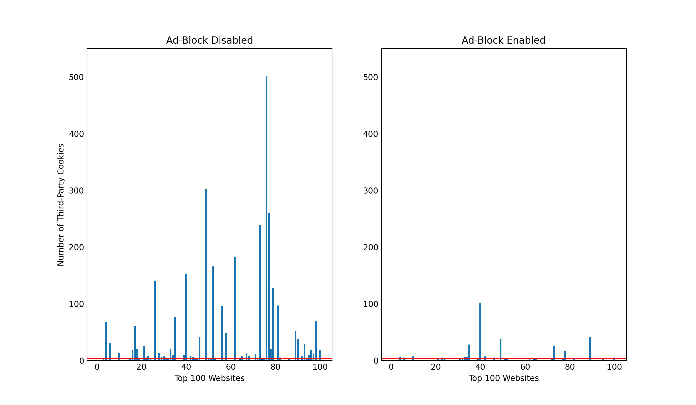

# OpenWPM Intro Project
## External Resources
The web crawls were conducted using the web privacy measurement framework OpenWPM. Further information about the framework can be found at the following repository: [https://github.com/mozilla/OpenWPM/blob/master/README.md](https://github.com/mozilla/OpenWPM/blob/master/README.md).

The top 100 websites were shortlisted and retrieved from [Tranco](https://tranco-list.eu/download_daily/56JN).
## Background
This project presents findings and analysis on data collected by crawling 100 websites using the OpenWPM framework. While conducting the crawls, three distinct metrics (HTTP Requests, Cookies, Javascript API Calls) were monitored in two different browser environments. The browsing environments were identical in all ways except the second browsing environment had an active ad-blocking extension (U Block Origin). The purpose of this project was to analyze the impacts this ad-blocking agent had on the three metrics that were being monitored.

## Third-Party HTTP Requets

## Third-Party Cookies

## Third-Party JavaScript API Calls

